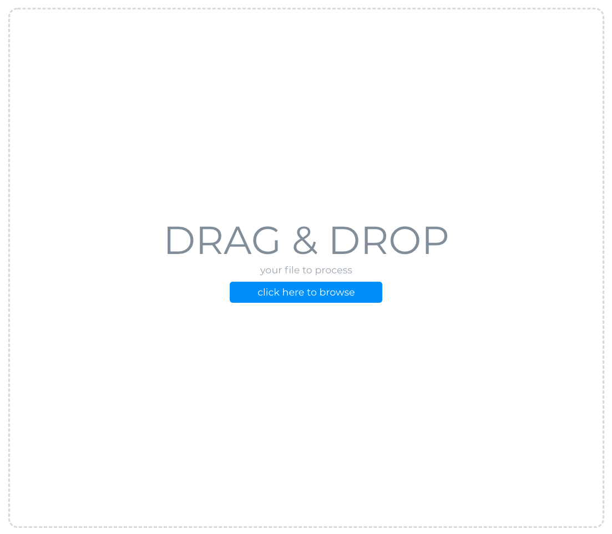

# Key Sentence Extractor
    - upload pdf
    - extract key phrases
    - display sentences with the ranked key phrases

This project implements EmbedRank algorithm to extract key phrases from documents using Doc2Vec model.

# Setup
    - install all packages in requirement.txt

# Usage
    - python3 server.py
    - select or drop a pdf

    - wait for server response
    - click sort to toggle between rank and original sentence
]

# TODO
    - change bottom left container to something else
    - fix bug that pdf shower dont refresh, probably because of caches
    - not using doc_processor module due to cost of aws textract